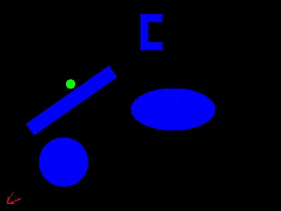

# RRT* for Randomly Appearing Obstacles

## About
This project simulates the searching and the path obtained by RRT* algorithm for a point robot in a map with obstacles.

For a test case you can try

Start x coordinate: 10
Start y coordinate: 10

Goal x coordinate: 100
Goal y coordinate: 180

## Result:

